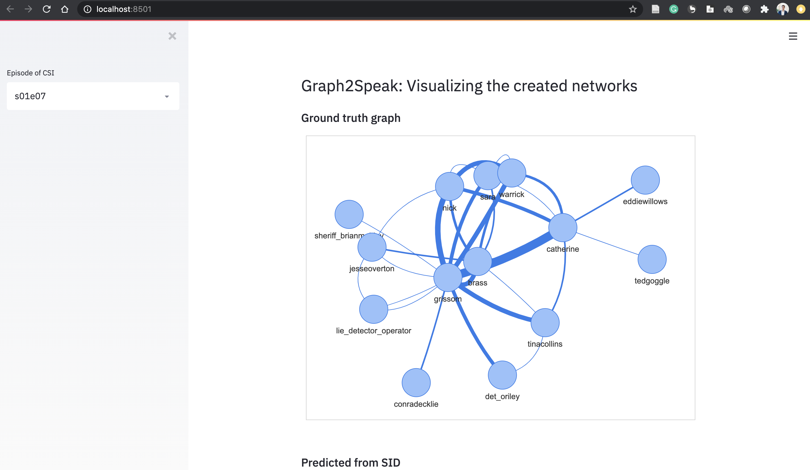

# Graph2Speak

Code associated with our paper "Graph2Speak: Improving Speaker Identification with Network Knowledge in Criminal Conversational Data".

https://arxiv.org/abs/2006.02093

***Abstract***:

  Criminal investigations mostly rely on the collection of speech conversational data in order to identify speakers and build or enrich an existing criminal network. Social network analysis tools are then applied to identify the most central characters and the different communities within the network. We introduce two candidate datasets for criminal conversational data, Crime Scene Investigation (CSI), a television show, and the ROXANNE simulated data. We also introduce the metric of conversation accuracy in the context of criminal investigations. By re-ranking candidate speakers based on the frequency of previous interactions, we improve the speaker identification baseline by 1.2% absolute (1.3% relative), and the conversation accuracy by 2.6% absolute (3.4% relative) on CSI data, and by 1.1% absolute (1.2% relative), and 2% absolute (2.5% relative) respectively on the ROXANNE simulated data.

Note: In this repo, you will only find data related to CSI, since ROXANNE simulated data are not open-source. Also, this repo will be migrated to IDIAP's account in a few months.

## What's in the repo?

- A notebook that goes through the data preparation
- A notebook that goes through Graph2Speak in a few steps
- The needed `requirements`
- The `src` code that contains:
	- The CSI dataset, in the `data` folder:
		- WAV files of some episodes
		- Transcripts, with timestamps, from the University of Edinburgh
	- The code to prepare the data (`data_processing.py`)
	- The code to run the Graph2Speak re-ranking model (`graph2speak.py`)
	- The `speaker_id_input` is a folder that contains our output of an X-vector speaker id baseline, ran in Kaldi (recipes provided), but can be replaced by any output of your choice

The rest of the folders are created automatically. 

## How to use it

To run it, you can:
- run `python src/data_processing.py`
- run your Speaker Identification from the data folder and the prepared output (our output is also provided as a benchmark)
- run `python src/graph2speak.py s01e07` to run it on season 1 episode 7 of CSI

## Generated graphs

In the output folder `generated_graph`, the output graphs are stored as HTML files. They were built with PyVis for network visualization.


## Interactive web application

We also provide a `streamlit` web application to visualize the differences between the graphs. First run the pipeline mentioned above, or use the pre-computed graphs we provide. To run it, simply type 
`streamlit run app.py` and open `http://localhost:8501/`.



# Results

Graph2Speak improves speaker identification in conversational data for which a graph can be built. We report below the performances of Graph2Speak on several episodes:

| Episode | Speaker acc. baseline (%) | Speaker acc. G2S (%)| Conv. acc. baseline (%) | Conv. acc. G2S (%) |
| --- | --- | --- | --- | --- |
| S01E07 | 91.6 | **92.7** | 84.4 | **88.8** |
| S01E08 | 91.9 | **95.3** | 80.6 | **88.8** |
| S02E01 | **88.0** | **88.0** | 71.4 | **73.5** |
| S02E04 | 88.1 | **89.0** | **76.1** | **76.1** |
| S02E06 | 86.2 | **88.6** | 70.9 | **74.5** |
| S02E09 | **92.3** | 91.3 | **81.4** | 79.1 |
| CSI Average | 89.6 | **90.8** | 77.5 | **80.1** |

# Stack

Network visualization relies on [PyVis](https://github.com/WestHealth/pyvis), and the framework for the interactive web application is [Streamlit](https://github.com/streamlit/streamlit).

---

To cite this work, please mention:

```
@article{fabien_improving_2020,
	title = {Improving {Speaker} {Identification} using {Network} {Knowledge} in {Criminal} {Conversational} {Data}},
	url = {http://arxiv.org/abs/2006.02093},
	urldate = {2020-06-11},
	journal = {arXiv:2006.02093 [cs, eess]},
	author = {Fabien, Mael and Sarfjoo, Seyyed Saeed and Motlicek, Petr and Madikeri, Srikanth},
	month = jun,
	year = {2020},
	note = {arXiv: 2006.02093},
	keywords = {Computer Science - Sound, Electrical Engineering and Systems Science - Audio and Speech Processing, Computer Science - Social and Information Networks},
}
```
