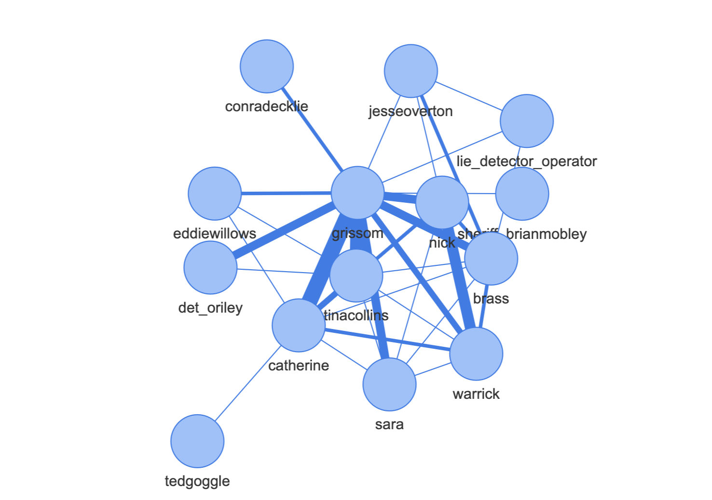

# Graph2Speak

Code associated with our paper "Graph2Speak: Improving Speaker Identification with Network Knowledge in Criminal Conversational Data".

https://arxiv.org/abs/2006.02093

***Abstract***:

Criminal investigations mostly rely on the collection of conversational data. The identity of speakers must be assessed in order to build or enrich an existing criminal network. Investigators then use social network analysis tools to identify the most central characters and the different communities within the network. We introduce Crime Scene Investigation (CSI) television show as a potential candidate for criminal conversational data. We also introduce the metric of conversation accuracy in the context of criminal investigations. We improve a speaker identification baseline by re-ranking candidate speakers based on the frequency of previous interactions between speakers and the topology of the criminal network.  We show that our approach outperforms the baseline speaker accuracy by **1.3% absolute** (1.5% relative), and the conversation accuracy by **3.7% absolute** (4.7% relative) on CSI data.

## What's in the repo?

- The CSI dataset, in the `data` folder:
	- WAV files of some episodes
	- Transcripts, with timestamps, from the University of Edinburgh
- The code to prepare the data (`data_processing.py`)
- A notebook that illustrates the data preparation
- The code to run the Graph2Speak re-ranking model (`graph2speak.py)
- A notebook that illustrates Graph2Speak in a few steps
- The `speaker_id_input` is a folder that contains our output of an X-vector speaker id baseline, ran in Kaldi (recipes provided), but can be replaced by any output of your choice

The rest of the folders are created automatically. 

## How to use it

To run it, you can:
- run `python data_processing.py`
- run your Speaker Identification from the data folder and the prepared output (our output is also provided as a benchmark)
- run `python graph2speak.py s01e07` to run it on season 1 episode 7 of CSI

## Generated graphs

In the output folder `generated_graph`, the output graphs are stored as HTML files. They were built with PyVis for network visualization.

